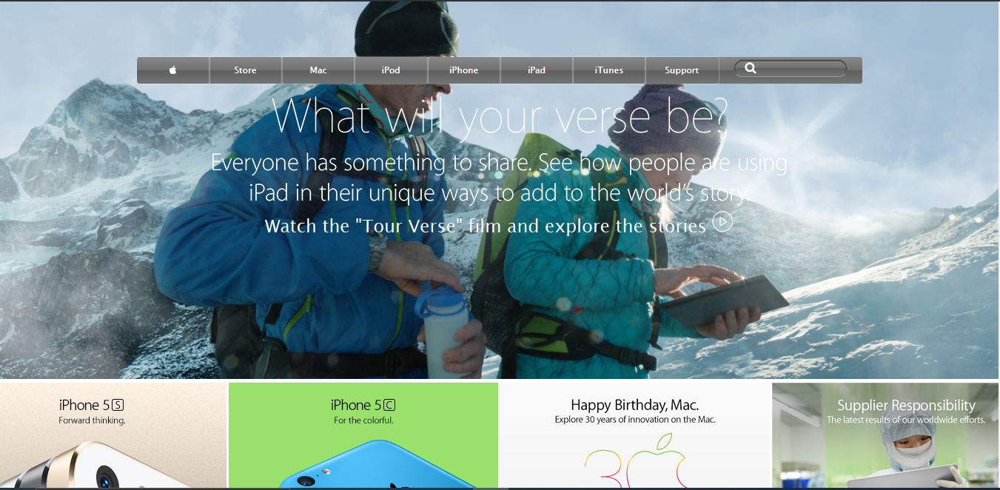

# Apple website clone

The goal is to make a clone of old an old version of the Apple website webpage.

This project consists of building a webpage using images as a background and adding gradients to elements.

## Built With

- HTML and CSS

## Live Demo

[Live Demo Link](https://mimipeshy.github.io/backgrounds-and-gradients)

## Getting Started

To get a local copy up and running follow these simple example steps.

### Prerequisites

Install `git` on your local machine

### Setup

Type `git init` in your local terminal

### Install

Clone the repository to your local machine `git clone https://github.com/mimipeshy/backgrounds-and-gradients.git ` 

### Usage

Cd into the repository `cd backgrounds-and-gradients`

Open the `index.html` file and run it with any browser of your choice

## Authors

👤 **Mimi Peshy**

- Github: [@githubhandle](https://github.com/mimipeshy)
- LinkedIn: [@linkedinhandle](https://www.linkedin.com/in/peris-ndanu-405083193/)

## 🤝 Contributing

Contributions, issues and feature requests are welcome!

Feel free to check the [issues page](issues/).

## Show your support

Give a ⭐️ if you like this project!

## Acknowledgments

- Hat tip to anyone whose code was used
- Inspiration
- etc

## 📝 License

This project is [MIT](lic.url) licensed.
